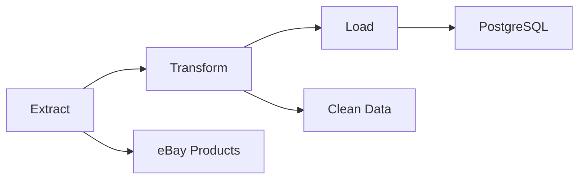

# 🕷️ Product ETL Web Scraper

[](https://www.python.org/downloads/)
[](https://opensource.org/licenses/MIT)
[](https://www.docker.com/)

A **modern, async Product ETL web scraper** for extracting product data from e-commerce sites and saving it to PostgreSQL. Built with aiohttp, BeautifulSoup, and psycopg, this project demonstrates a robust **ETL (Extract, Transform, Load) pipeline** with Docker support.

## ✨ Features

- **Async ETL Pipeline**: High-performance extraction, transformation, and loading
- **Anti-Detection**: Random browser headers, delays, and retry logic to avoid blocks
- **Database Integration**: Direct PostgreSQL insertion with connection pooling
- **Fully Dockerized**: One-command deployment with Docker Compose
- **Test Coverage**: Automated tests with pytest
- **Modern Stack**: Uses `uv` for lightning-fast dependency management

## 📁 Project Structure

```
product-etl-webscraper/
├── main.py                  # Pipeline runner & entry point
├── src/
│   ├── ebay_data_extract.py # eBay ETL logic & data processing
│   └── web_scraper.py       # Async scraper with anti-detection
├── tests/                   # Automated tests (pytest)
├── pyproject.toml           # Project dependencies & config
├── uv.lock                  # Locked dependencies
├── Dockerfile               # Container build instructions
├── docker-compose.yaml      # Multi-service orchestration
├── .env.example             # Environment variables template
└── README.md                # This file
```

## 🔄 How It Works



## 🚀 Quick Start

### Option 1: Local Development

```bash
# Clone the repository
git clone https://github.com/your-username/python-webscraper.git
cd python-webscraper

# Install dependencies (requires uv)
uv sync

# Set up environment
cp .env.example .env
# Edit .env with your database credentials

# Run the scraper
uv run python main.py
```

### Option 2: Docker (Recommended)

```bash
# One command to rule them all
docker compose up -d --build

# Check logs
docker compose logs -f webscraper
```

## ⚙️ Configuration

Create a `.env` file (copy from `.env.example`):

```env
# Database Configuration
DB_HOST=localhost
DB_NAME=scraper_db
DB_USER=postgres
DB_PASSWORD=your_secure_password
DB_PORT=5432
```

1. **Extract**: Scrapes eBay product listings with anti-detection measures
2. **Transform**: Cleans and validates data, converts to structured format
3. **Load**: Inserts data into PostgreSQL with conflict resolution

## 🚨 Legal & Ethical Usage

⚠️ **Important**: This tool is for educational purposes. Please:

- Respect robots.txt
- Use reasonable delays between requests
- Don't overload target servers
- Comply with terms of service
- Consider using official APIs when available

## 📋 Requirements

- **Python**: 3.13+ (for latest async features)
- **Database**: PostgreSQL 13+
- **Package Manager**: [uv](https://github.com/astral-sh/uv) (recommended) or pip
- **Docker**: 20.10+ (optional, for containerized deployment)

## 🐛 Troubleshooting

### Common Issues

**Connection Refused Error**
```bash
# Check if PostgreSQL is running
docker compose ps
# Restart services
docker compose restart
```

**Scraping Blocked**
- Increase delays in `.env`
- Check if you need to rotate User-Agents
- Consider using proxies for high-volume scraping

**Database Connection Issues**
- Verify credentials in `.env`
- Ensure database exists: `CREATE DATABASE scraper_db;`
- **Running with Docker: Database Not Found**
  If you are running the app with Docker and your PostgreSQL server is on your host machine, set `DB_HOST=host.docker.internal` in your `.env` file. This allows the container to access the database on your host system.

## 🤝 Contributing

1. Fork the repository
2. Create a feature branch: `git checkout -b feature/amazing-feature`
3. Add tests for your changes
4. Run the test suite: `uv run pytest`
5. Commit your changes: `git commit -m 'Add amazing feature'`
6. Push to branch: `git push origin feature/amazing-feature`
7. Open a Pull Request

## 📄 License

This project is licensed under the MIT License - see the [LICENSE](LICENSE) file for details.

## ⭐ Support

If this project helped you, please give it a ⭐ on GitHub!

---

<div align="center">

**Made with ❤️ for the Python community**

[Report Bug](https://github.com/your-username/python-webscraper/issues) · [Request Feature](https://github.com/your-username/python-webscraper/issues) · [Contribute](https://github.com/your-username/python-webscraper/pulls)

</div>